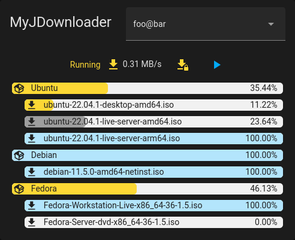
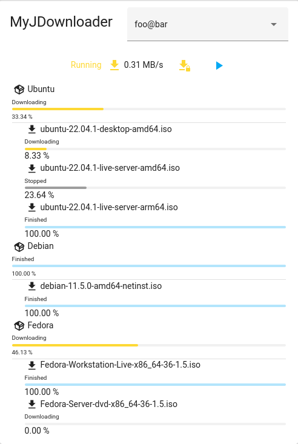

[](https://github.com/hacs/integration)
[](https://github.com/Nyaran/myjdownloader-card/releases)
[](https://github.com/Nyaran/myjdownloader-card/releases/latest)

[](https://ko-fi.com/nyaran)
[](https://www.buymeacoffee.com/nyaran)

# Custom MyJDownloader Card for HomeAssistant/Lovelace

This Lovelace custom card displays downloads information provided by the MyJDownloader Integration.
It also supports enable limit speed mode and play/pause/stop of all downloads.
If you have multiple MyJDownloader instances associated to your account, you can cycle through all of them.

## Installation

### Prerequisites
 - Install and configure [MyJDownloader integration](https://github.com/doudz/homeassistant-myjdownloader).
 - Enable `sensor.jdownloader_<instance-name>_packages` and `sensor.jdownloader_<instance-name>_links` entities.

### [HACS](https://hacs.xyz/) method (recommended)

MyJDownloader Card is available in HACS (Home Assistant Community Store).

- Install HACS if you don't have it already
- Open HACS in Home Assistant
- Go to "Frontend" section
- Click button with "+" icon
- Search for "MyJDownloader Card"

Or just use [](https://my.home-assistant.io/redirect/hacs_repository/?owner=Nyaran&repository=myjdownloader-card&category=plugin)

### Manual method

- Download the [latest release](https://github.com/Nyaran/myjdownloader-card/releases/latest/download/myjdownloader-card.js)
- Create a folder named `myjdownloader-card` into `www` folder into your HA installation, as explained in [official documentation](https://developers.home-assistant.io/docs/frontend/custom-ui/registering-resources/)
- Copy or move the `myjdownloader-card.js` file into that folder 
- Add the card to the resources in configuration.yaml:

```
resources:
	- {type: js, url: '/hacsfiles/myjdownloader-card/myjdownloader-card.js'}
```

- Restart HA

## Options

### Card options

| Name             | Type    | Required     | Default         | Description                                                                     |
|------------------|---------|--------------|-----------------|---------------------------------------------------------------------------------|
| type             | string  | **required** |                 | `custom:myjdownloader-card`                                                     |
| header_title     | string  | optional     | `MyJDownloader` | Header text at the top of card                                                  |
| sensor_name      | string  | optional     | `jdownloader`   | Name of the sensor                                                              |
| display_mode     | string  | optional     | `compact`       | Display mode: compact or full                                                   |
| list_mode        | string  | optional     | `full`          | List mode: "full" shows packages and links, or shown only "packages" or "links" |
| default_instance | string  | optional     |                 | Default instance to show, if not set, the first one is used.                    |
| hide_title       | boolean | optional     | false           | Hide header text at the top of card                                             |
| hide_instance    | boolean | optional     | false           | Hide MyJDownloader instance selector                                            |
| hide_play        | boolean | optional     | false           | Hide play button                                                                |
| hide_pause       | boolean | optional     | false           | Hide pause button                                                               |
| hide_stop        | boolean | optional     | false           | Hide stop button                                                                |
| hide_speed_limit | boolean | optional     | false           | Hide speed limit button                                                         |
Please find below an example of ui-lovelace.yaml card entry:

```yaml
		cards:
		- type: custom:myjdownloader-card
		default_instance: 'foo@bar'
		hide_instance: true
```

## Preview

MyJDownloader Card in "compact" mode (dark theme):



MyJDownloader Card in "full" mode (light theme):



## Thanks

[@home-assistant](https://github.com/home-assistant/) and [@hacs](https://github.com/hacs/) teams, for their awesome work.

[ @amaximus](https://github.com/amaximus/) for his work on [transmission-card](https://github.com/amaximus/transmission-card), which this card is heavily inspired by.
